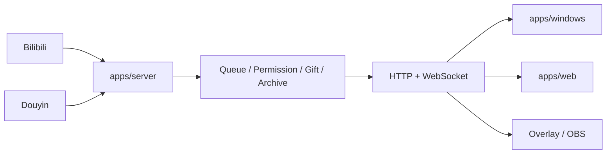

<div align="center">

# Bilipdj · 弹幕排队姬

**面向 Bilibili / 抖音直播间的本地化弹幕排队、权限控制、队列存档与 OBS 展示工具。**

[下载发行版](https://github.com/ZzzHe2333/bilipdj/releases) · [使用教程](./GUIDE.md) · [更新日志](./UPDATE.md) · [问题反馈](https://github.com/ZzzHe2333/bilipdj/issues)

</div>

---

BiliPDJ 采用单仓库 Monorepo。Server 是唯一状态源，Windows、Web、OBS 通过 HTTP/WebSocket 共用同一套队列、权限、礼物、平台连接和存档状态。

> 当前正式接入的平台是 **Bilibili** 与 **抖音**。虎牙、快手、斗鱼、微信视频号目前仅保留配置位。

## v2.0.2 客户便携版

v2.0.2 提供两种 Windows x64 客户包，**都自带后端和 Web 资源，不需要安装 Python，也不需要手工启动 Server**。

| 版本 | 发布文件 | 启动方式 | 后端行为 |
|---|---|---|---|
| Tk Windows 便携版 | `BiliPDJ-v2.0.2-Windows-Tk-Portable-x64.zip` | 解压后双击 `main.exe` | 桌面前端启动后自动拉起内置后端 |
| Web 便携版 | `BiliPDJ-v2.0.2-Web-Portable-x64.zip` | 解压后双击 `BiliPDJ-Web.exe` | 启动器自动拉起内置后端，服务就绪后自动打开浏览器管理页 |

两个 ZIP 都会同时发布 `.sha256` 校验文件。**请完整解压整个 ZIP，不要只复制单个 EXE。**

Web 便携启动器如果发现对应端口已有后端运行，会直接复用现有服务；只有它自己启动的后端才会在“停止并退出”时被终止。

### v2.0.2 设置备份

设置备份支持 **WebDAV / 本地文件夹 / SMB-NAS** 三种目标。备份包只包含实际存在的 `config.yaml`、`quanxian.yaml`、`kaiguan.yaml`、`style.json`，并保留各文件最后修改时间；不会备份队列、黑名单、日志、WebDAV 密码或 NAS 凭据。

Tk 桌面端在“设置”中提供独立可滚动的“数据备份”页；Web 配置页提供同等的备份、历史、恢复和自动备份操作。

## 当前目录

```text
bilipdj/
├─ apps/
│  ├─ server/                 # 后端真实实现
│  │  ├─ server.py
│  │  ├─ bilibili_*.py / douyin_*.py
│  │  └─ main.py
│  ├─ web/                    # Web 唯一源码目录
│  │  ├─ static/              # HTML/CSS/JS
│  │  ├─ portable_launcher.py # Web 便携启动器
│  │  ├─ web_portable.spec
│  │  └─ package-portable.ps1
│  └─ windows/                # Tk 桌面端真实实现
│     ├─ control_panel.py
│     ├─ portable_autostart.py
│     ├─ overlay_host.py
│     ├─ update_*.py / updater*.py
│     ├─ main.py
│     └─ *.spec
├─ packages/shared/
├─ core/                      # 旧导入/旧命令兼容层 + 兼容运行数据位置
├─ tests/
└─ .github/workflows/
```

### `core/` 现在是什么

`core/` 不再是 Server 和 Windows 的主要实现目录。已经迁移的同名 Python 文件仅保留轻量兼容转发，因此旧代码中的 `import core.server`、`import core.control_panel` 仍可工作。

源码模式下的 `config.yaml`、`quanxian.yaml`、`kaiguan.yaml`、`style.json` 以及 `core/cd/` 暂时继续使用原位置。`core/ui/` 已删除；Web 静态资源只有 `apps/web/static/` 一套。

## Windows 桌面端

源码启动：

```powershell
python -m pip install -r requirements.txt
python -m apps.windows.main
```

本地打包：

```powershell
powershell -ExecutionPolicy Bypass -File .\apps\windows\package.ps1 -InstallDependencies
```

主要产物：

```text
dist\bilipdj\main.exe
dist\bilipdj\paiduijitm.exe
dist\bilipdj\updater.exe
```

## Web 前端

静态 Web 构建：

```bash
python apps/web/build.py
```

Windows Web 便携版构建：

```powershell
powershell -ExecutionPolicy Bypass -File .\apps\web\package-portable.ps1 -InstallDependencies
```

主要便携产物：

```text
dist\web-portable\bilipdj-web\BiliPDJ-Web.exe
```

## Server 后端

```bash
python -m pip install -r apps/server/requirements.txt
python -m apps.server.main
```

局域网监听：

```bash
python -m apps.server.main --host 0.0.0.0 --port 9816
```

Docker：

```bash
docker build -f apps/server/Dockerfile -t bilipdj-server .
docker run --rm -p 9816:9816 bilipdj-server
```

## 默认地址

| 地址 | 用途 |
|---|---|
| `http://127.0.0.1:9816/config` | 登录与配置页 |
| `http://127.0.0.1:9816/index` | Web 队列看板 |
| `GET /health` | 后端健康检查 |
| `GET /api/runtime-status` | 运行状态 |
| `GET /api/queue/state` | 队列状态 |
| `ws://127.0.0.1:9816/ws` | WebSocket |

## 架构



核心原则：**Server 是唯一状态源，前端不重复实现业务规则。**

## 功能概览

| 能力 | 说明 |
|---|---|
| Bilibili / 抖音弹幕 | 平台协议接入、身份和消息解析 |
| 排队引擎 | 入队、取消、修改、删除、插队、暂停/恢复 |
| 权限体系 | `super_admin`、`admin`、`jianzhang`、`member`、`blacklist` |
| 礼物插队 | 按礼物、电池数、次数、插入名次等条件控制 |
| 队列存档 | 多槽位存档、切换与恢复 |
| 设置备份 | WebDAV / 本地文件夹 / SMB-NAS，只备份四个设置文件并保留 mtime |
| Windows 管理端 | 配置、日志、队列、权限、平台参数、样式、性能、原生扫码登录 |
| Web / OBS | 浏览器管理/展示、透明弹窗、实时 WebSocket 更新 |
| 本地数据 | 配置、权限、日志和队列数据保存在本机 |

## CI / 构建验证

- `.github/workflows/quality.yml`：完整回归测试
- `.github/workflows/server.yml`：验证 Server 入口和兼容层
- `.github/workflows/web.yml`：独立构建 Web 静态资源
- `.github/workflows/package-windows-x64.yml`：同时实际构建 Tk Windows Portable 与 Web Portable，并生成 ZIP/SHA256/Release

## 安全

配置可能包含 Cookie、`SESSDATA`、`bili_jct` 或其他登录凭据，请勿提交到仓库或公开截图。后端默认监听 `127.0.0.1:9816`；如改为 `0.0.0.0` 提供局域网访问，应自行限制网络范围，不建议直接暴露到公网。

## 文档

- [GUIDE.md](./GUIDE.md)：使用教程
- [UPDATE.md](./UPDATE.md)：更新日志
- [RELEASE_NOTES.md](./RELEASE_NOTES.md)：发行说明
- [packages/shared/api-contract.md](./packages/shared/api-contract.md)：前端共享 API 契约
- [Issues](https://github.com/ZzzHe2333/bilipdj/issues)：Bug、建议和任务跟踪

## 许可证

本项目基于 [GNU General Public License v3.0](./LICENSE) 发布。
