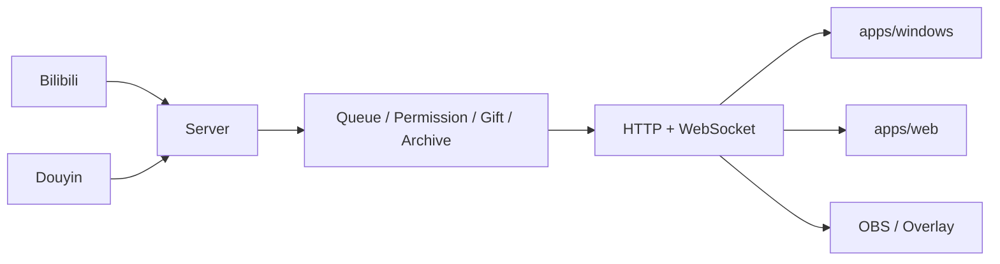

<div align="center">

# Bilipdj · 弹幕排队姬

**面向 Bilibili / 抖音直播间的本地化弹幕排队、权限控制、队列存档与 OBS 展示工具。**

[下载发行版](https://github.com/ZzzHe2333/bilipdj/releases) · [使用教程](./GUIDE.md) · [更新日志](./UPDATE.md) · [问题反馈](https://github.com/ZzzHe2333/bilipdj/issues)

</div>

---

BiliPDJ 采用 **单仓库 Monorepo**：后端、Web 前端和 Windows 前端拥有独立目录、独立启动/构建入口，同时共享同一个后端状态源。排队、权限、礼物和直播平台连接只在 Server 计算一次，Windows、Web、OBS 均通过本地 HTTP/WebSocket 读取结果。

> 当前正式接入的平台是 **Bilibili** 与 **抖音**。虎牙、快手、斗鱼、微信视频号目前仅保留配置位。

## Monorepo 结构

```text
bilipdj/
├─ apps/
│  ├─ server/                 # 独立后端入口 / Docker
│  │  ├─ main.py
│  │  ├─ requirements.txt
│  │  └─ Dockerfile
│  ├─ web/                    # Web 前端
│  │  ├─ static/              # HTML/CSS/JS 源文件
│  │  └─ build.py             # 独立构建到 dist/
│  └─ windows/                # Windows 桌面端
│     ├─ main.py
│     ├─ package.ps1
│     └─ *.spec
├─ packages/
│  └─ shared/                 # HTTP/WebSocket 契约与未来共享类型
├─ core/                      # 现有稳定实现层 / 兼容层
├─ tests/
├─ scripts/
└─ .github/workflows/
```

### 为什么仍然保留 `core/`

这次拆分优先建立 **应用边界和独立发布链**，没有为了移动目录而重写已经稳定的大量 Python 代码。当前 `core/` 仍提供成熟的后端和 Tk 桌面实现，`apps/server` 与 `apps/windows` 作为新的正式入口调用它；Web 源码已经独立到 `apps/web/static`。这样现有测试、旧命令和 macOS 发布可以继续工作，后续再把 `core/` 内模块逐步迁移，不需要再次改变对外入口。

## 三个应用如何运行

### Windows 桌面端

源码启动：

```powershell
python -m pip install -r requirements.txt
python -m apps.windows.main
```

独立打包：

```powershell
powershell -ExecutionPolicy Bypass -File .\apps\windows\package.ps1 -InstallDependencies
```

旧命令仍兼容：

```powershell
powershell -ExecutionPolicy Bypass -File .\package-windows-local.ps1 -InstallDependencies
```

产物：

```text
dist\bilipdj\main.exe
dist\bilipdj\paiduijitm.exe
dist\bilipdj\updater.exe
```

### Web 前端

Web UI 目前是原生 HTML/CSS/JavaScript，不需要 Node：

```bash
python apps/web/build.py
```

产物：

```text
apps/web/dist/
```

该目录可以单独交给静态服务器，也可以由 Server 加载：

```bash
python -m apps.server.main --web-dir apps/web/dist
```

### Server 后端

```bash
python -m pip install -r apps/server/requirements.txt
python -m apps.server.main
```

局域网监听：

```bash
python -m apps.server.main --host 0.0.0.0 --port 9816
```

Docker：

```bash
docker build -f apps/server/Dockerfile -t bilipdj-server .
docker run --rm -p 9816:9816 bilipdj-server
```

## 默认地址

| 地址 | 用途 |
|---|---|
| `http://127.0.0.1:9816/config` | 登录与配置页 |
| `http://127.0.0.1:9816/index` | Web 队列看板 |
| `GET /health` | 后端健康检查 |
| `GET /api/runtime-status` | 运行状态 |
| `GET /api/queue/state` | 队列状态 |
| `ws://127.0.0.1:9816/ws` | WebSocket |
| `ws://127.0.0.1:9816/danmu/sub` | WebSocket 别名 |

## 架构



核心原则：**Server 是唯一状态源，前端不重复实现业务规则。**

## 功能概览

| 能力 | 说明 |
|---|---|
| Bilibili / 抖音弹幕 | 平台协议接入、身份和消息解析 |
| 排队引擎 | 入队、取消、修改、删除、插队、暂停/恢复 |
| 权限体系 | `super_admin`、`admin`、`jianzhang`、`member`、`blacklist` |
| 礼物插队 | 按礼物、电池数、次数、插入名次等条件控制 |
| 队列存档 | 多槽位存档、切换与恢复 |
| Windows 管理端 | 配置、日志、队列、权限、平台参数、样式、性能 |
| Web / OBS | 浏览器展示、透明弹窗、实时 WebSocket 更新 |
| 本地数据 | 配置、权限、日志和队列数据保存在本机 |

## 配置与安全

源码兼容模式下，运行配置仍由 `core/` 实现层管理；打包运行时配置位于可执行文件附近。配置可能包含 Cookie、`SESSDATA`、`bili_jct` 或其他登录凭据，请勿提交到仓库或公开截图。

后端默认监听 `127.0.0.1:9816`。如果改为 `0.0.0.0` 提供局域网访问，应自行限制网络范围，不建议直接暴露到公网。

## CI / 独立构建

- `.github/workflows/package-windows-x64.yml`：Windows 独立打包，入口为 `apps/windows/package.ps1`
- `.github/workflows/web.yml`：只构建 `apps/web`
- `.github/workflows/server.yml`：验证 Server 独立入口和 Web 资源绑定
- 原有质量检查、敏感信息扫描和 macOS 构建继续保留

Windows/Web/Server 可以分别触发对应工作流；Web 修改不需要重新组织后端源码，Server 与 Windows 也拥有明确的独立入口。

## 文档

- [GUIDE.md](./GUIDE.md)：使用教程
- [UPDATE.md](./UPDATE.md)：更新日志
- [RELEASE_NOTES.md](./RELEASE_NOTES.md)：发行说明
- [packages/shared/api-contract.md](./packages/shared/api-contract.md)：前端共享 API 契约
- [Issues](https://github.com/ZzzHe2333/bilipdj/issues)：Bug、建议和任务跟踪

## 许可证

本项目基于 [GNU General Public License v3.0](./LICENSE) 发布。
