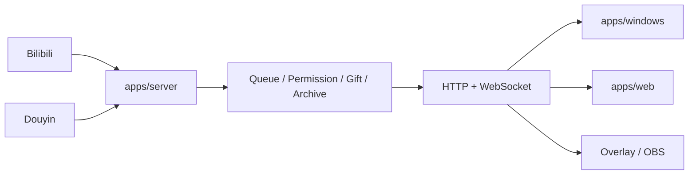

<div align="center">

# Bilipdj · 弹幕排队姬

**面向 Bilibili / 抖音直播间的本地化弹幕排队、权限控制、队列存档与 OBS 展示工具。**

[下载发行版](https://github.com/ZzzHe2333/bilipdj/releases) · [使用教程](./GUIDE.md) · [更新日志](./UPDATE.md) · [问题反馈](https://github.com/ZzzHe2333/bilipdj/issues)

</div>

---

BiliPDJ 采用单仓库 Monorepo。后端、Web 前端和 Windows 桌面端已经拥有独立目录和独立构建入口；排队、权限、礼物和平台连接只在 Server 维护一份状态，Windows、Web、OBS 通过 HTTP/WebSocket 使用同一状态源。

> 当前正式接入的平台是 **Bilibili** 与 **抖音**。虎牙、快手、斗鱼、微信视频号目前仅保留配置位。

## 当前目录

```text
bilipdj/
├─ apps/
│  ├─ server/                 # 后端真实实现
│  │  ├─ server.py            # HTTP/WebSocket、队列和平台运行时
│  │  ├─ bilibili_*.py
│  │  ├─ douyin_*.py
│  │  ├─ queue_*.py
│  │  ├─ main.py              # 独立启动入口
│  │  └─ Dockerfile
│  ├─ web/                    # Web 唯一源码目录
│  │  ├─ static/              # HTML/CSS/JS
│  │  └─ build.py
│  └─ windows/                # 桌面端真实实现
│     ├─ control_panel.py
│     ├─ overlay_host.py
│     ├─ update_*.py / updater*.py
│     ├─ assets/
│     ├─ main.py
│     ├─ package.ps1
│     └─ *.spec
├─ packages/shared/           # HTTP/WebSocket 契约与共享定义
├─ core/                      # 旧导入/旧命令兼容层 + 兼容运行数据位置
├─ tests/
└─ .github/workflows/
```

### `core/` 现在是什么

`core/` 不再是 Server 和 Windows 的主要实现目录。已经迁移的同名 Python 文件仅保留轻量兼容转发，因此旧代码中的 `import core.server`、`import core.control_panel` 仍可工作，旧命令 `python core/control_panel.py` 也会跳转到新入口。

为了避免一次迁移同时改变用户数据位置，源码模式下的 `config.yaml`、`quanxian.yaml`、`kaiguan.yaml`、`style.json` 以及 `core/cd/` 暂时继续使用原位置。后续可以单独迁移运行数据，不需要再次调整应用目录。

`core/ui/` 已删除；Web 静态资源只有 `apps/web/static/` 一套。

## Windows 桌面端

源码启动：

```powershell
python -m pip install -r requirements.txt
python -m apps.windows.main
```

独立打包：

```powershell
powershell -ExecutionPolicy Bypass -File .\apps\windows\package.ps1 -InstallDependencies
```

兼容旧打包命令：

```powershell
powershell -ExecutionPolicy Bypass -File .\package-windows-local.ps1 -InstallDependencies
```

主要产物：

```text
dist\bilipdj\main.exe
dist\bilipdj\paiduijitm.exe
dist\bilipdj\updater.exe
```

## Web 前端

Web UI 使用原生 HTML/CSS/JavaScript：

```bash
python apps/web/build.py
```

产物：

```text
apps/web/dist/
```

Server 默认直接读取 `apps/web/static`，也可以指定构建产物：

```bash
python -m apps.server.main --web-dir apps/web/dist
```

## Server 后端

```bash
python -m pip install -r apps/server/requirements.txt
python -m apps.server.main
```

局域网监听：

```bash
python -m apps.server.main --host 0.0.0.0 --port 9816
```

Docker：

```bash
docker build -f apps/server/Dockerfile -t bilipdj-server .
docker run --rm -p 9816:9816 bilipdj-server
```

## 默认地址

| 地址 | 用途 |
|---|---|
| `http://127.0.0.1:9816/config` | 登录与配置页 |
| `http://127.0.0.1:9816/index` | Web 队列看板 |
| `GET /health` | 后端健康检查 |
| `GET /api/runtime-status` | 运行状态 |
| `GET /api/queue/state` | 队列状态 |
| `ws://127.0.0.1:9816/ws` | WebSocket |
| `ws://127.0.0.1:9816/danmu/sub` | WebSocket 别名 |

## 架构



核心原则：**Server 是唯一状态源，前端不重复实现业务规则。**

## 功能概览

| 能力 | 说明 |
|---|---|
| Bilibili / 抖音弹幕 | 平台协议接入、身份和消息解析 |
| 排队引擎 | 入队、取消、修改、删除、插队、暂停/恢复 |
| 权限体系 | `super_admin`、`admin`、`jianzhang`、`member`、`blacklist` |
| 礼物插队 | 按礼物、电池数、次数、插入名次等条件控制 |
| 队列存档 | 多槽位存档、切换与恢复 |
| Windows 管理端 | 配置、日志、队列、权限、平台参数、样式、性能 |
| Web / OBS | 浏览器展示、透明弹窗、实时 WebSocket 更新 |
| 本地数据 | 配置、权限、日志和队列数据保存在本机 |

## CI / 构建验证

- `.github/workflows/quality.yml`：编译 `apps/`、兼容 `core/`、脚本和测试，并运行完整回归测试
- `.github/workflows/server.yml`：验证真实后端位于 `apps/server`，并检查旧 `core.server` 转发兼容
- `.github/workflows/web.yml`：独立构建 `apps/web`
- `.github/workflows/package-windows-x64.yml`：从 `apps/windows` 实际执行 Windows PyInstaller 打包
- macOS 兼容构建的 spec 也已切到 `apps/*` 实现路径

## 安全

配置可能包含 Cookie、`SESSDATA`、`bili_jct` 或其他登录凭据，请勿提交到仓库或公开截图。后端默认监听 `127.0.0.1:9816`；如改为 `0.0.0.0` 提供局域网访问，应自行限制网络范围，不建议直接暴露到公网。

## 文档

- [GUIDE.md](./GUIDE.md)：使用教程
- [UPDATE.md](./UPDATE.md)：更新日志
- [RELEASE_NOTES.md](./RELEASE_NOTES.md)：发行说明
- [packages/shared/api-contract.md](./packages/shared/api-contract.md)：前端共享 API 契约
- [Issues](https://github.com/ZzzHe2333/bilipdj/issues)：Bug、建议和任务跟踪

## 许可证

本项目基于 [GNU General Public License v3.0](./LICENSE) 发布。
