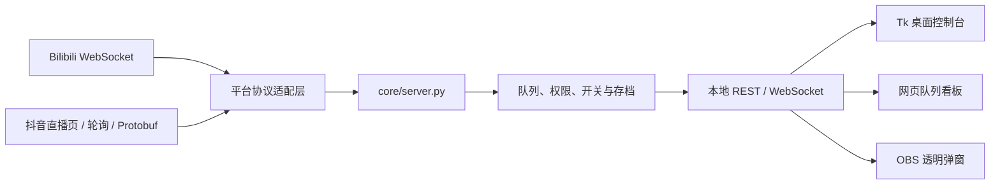

<div align="center">

# Bilipdj · 弹幕排队姬

**面向直播间的本地化弹幕排队、权限控制、队列存档与 OBS 展示工具。**

<p>
  <a href="https://github.com/ZzzHe2333/bilipdj/releases"></a>
  <a href="https://github.com/ZzzHe2333/bilipdj/actions/workflows/package-windows-x64.yml"></a>
  <a href="https://github.com/ZzzHe2333/bilipdj/actions/workflows/package-macos.yml"></a>
  
  <a href="./LICENSE"></a>
</p>

<p>
  <a href="https://github.com/ZzzHe2333/bilipdj/stargazers"></a>
  <a href="https://github.com/ZzzHe2333/bilipdj/releases"></a>
</p>

[下载发行版](https://github.com/ZzzHe2333/bilipdj/releases) · [使用教程](./GUIDE.md) · [更新日志](./UPDATE.md) · [问题反馈](https://github.com/ZzzHe2333/bilipdj/issues) · [贡献者](./CONTRIBUTORS.md)

</div>

---

Bilipdj 将 **弹幕接入、排队规则、权限判断、队列存档和展示输出** 集中在本地 Python 后端中处理。桌面控制台负责配置与管理，网页看板和透明弹窗负责展示，从而避免多个前端各自计算队列导致状态不一致。

> [!IMPORTANT]
> 当前正式接入的平台是 **Bilibili** 与 **抖音**。虎牙、快手、斗鱼、微信视频号目前仅保留配置位，尚未接入实时弹幕。

## 功能概览

| 能力 | 说明 |
|---|---|
| 多平台弹幕 | Bilibili 二进制 WebSocket 协议；抖音直播页参数解析、轮询与 Protobuf 消息解析 |
| 统一排队引擎 | 入队、取消、修改、删除、插队、暂停与恢复等规则均由后端处理 |
| 桌面控制台 | 现代化明暗主题界面，集中管理服务、日志、队列、平台参数、权限、开关和样式 |
| 权限体系 | `super_admin`、`admin`、`jianzhang`、`member`、`blacklist` 五级角色 |
| 功能开关 | 排队总开关、官服/B服/超级/米服排队、取消、修改、舰长插队和房管权限 |
| 队列与配置存档 | 10 个队列存档槽位，并支持多套平台配置快速切换 |
| B站送礼插队 | 按礼物、电池数、可用次数、插入名次等条件授予排队资格 |
| 每日次数限制 | 可限制单个用户每日成功入队次数，并自定义统计日重置时间 |
| OBS 透明弹窗 | 独立透明窗口、置顶控制、尺寸缩放、字体和描边样式预览 |
| 本地数据管理 | 配置、权限、日志和队列数据保存在本机，不依赖远程数据库 |

## 界面结构

当前桌面控制台采用 **7 个一级页面**：

| 页面 | 用途 |
|---|---|
| 日志 | 查看实时后端日志，支持日志等级过滤和搜索 |
| 当前排队 | 查看队列、切换存档、删除、移动、插入和清空条目 |
| 设置 | 基础设置、平台参数、黑名单、功能开关、样式设置，以及 Bilibili 平台下的送礼插队 |
| 透明窗口 | 启动、关闭、置顶和调整 OBS 透明弹窗 |
| 权限 | 编辑超级管理员、管理员、舰长、普通成员和黑名单名单 |
| 性能 | 查看 CPU、内存、磁盘和可用的 GPU 占用信息 |
| 关于 | 查看版本和项目信息 |

## 快速开始

### 方式一：使用发行版

前往 [Releases](https://github.com/ZzzHe2333/bilipdj/releases) 下载对应平台的压缩包：

- Windows x64：`bilibili-danmuji-windows-x64-<tag>.zip`
- macOS Apple Silicon：`bilibili-danmuji-macos-arm64-<tag>.tar.gz`
- macOS Intel：`bilibili-danmuji-macos-x86_64-<tag>.tar.gz`

解压后运行：

- Windows：`main.exe`
- macOS：`main`

透明弹窗程序会随主程序一同打包，无需单独下载。

### 方式二：从源码运行

```bash
git clone --depth 1 --branch now https://github.com/ZzzHe2333/bilipdj.git
cd bilipdj
python -m pip install "qrcode[pil]" brotli psutil PyYAML protobuf
python core/control_panel.py
```

源码运行建议使用 Python 3.10 或更高版本。项目 CI 使用 Python 3.11 构建发行包。

## 首次使用

1. 打开桌面控制台的 **设置 → 平台参数**。
2. 选择直播平台：
   - **Bilibili**：填写直播间号，或点击顶部 **登录配置**，在浏览器中扫码获取 UID 和 Cookie。
   - **抖音**：粘贴直播间链接，点击 **获取参数** 自动解析 `live_id`、`room_id` 等信息。
3. 点击 **保存配置**。
4. 点击顶部 **启动服务**，等待连接状态变为已连接。
5. 按需打开队列看板或 OBS 透明弹窗。

默认本地地址：

| 地址 | 用途 |
|---|---|
| `http://127.0.0.1:9816/config` | 登录与 Cookie 配置 |
| `http://127.0.0.1:9816/index` | 网页队列看板 |
| `ws://127.0.0.1:9816/danmu/sub` | 本地弹幕与状态 WebSocket |

更完整的接入步骤见 [GUIDE.md](./GUIDE.md)。

## 运行架构



核心原则：**状态只在后端计算一次，所有界面读取同一份队列状态。**

## 平台支持状态

| 平台 | 状态 | 当前能力 |
|---|---|---|
| Bilibili | 可用 | 扫码登录、房间解析、弹幕接收、身份识别、礼物与上舰事件 |
| 抖音 | 可用 | 直播链接解析、参数回填、弹幕轮询与消息解析 |
| 虎牙 | 预留 | 可保存配置，暂不接入弹幕 |
| 快手 | 预留 | 可保存配置，暂不接入弹幕 |
| 斗鱼 | 预留 | 可保存配置，暂不接入弹幕 |
| 微信视频号 | 预留 | 可保存配置，暂不接入弹幕 |

## 常用弹幕指令

### 普通用户

| 弹幕内容 | 效果 |
|---|---|
| `排队` | 使用昵称加入队列 |
| `排队 [内容]` | 携带自定义内容加入队列 |
| `官服排` / `官服排队` | 以官服标识加入队列 |
| `B服排` / `排B服` | 以 B 服标识加入队列 |
| `超级排` / `超级排队` | 以特殊样式加入队列 |
| `小米排` / `排米服` | 以米服标识加入队列 |
| `取消排队` | 离开当前队列 |
| `替换 [内容]` / `修改 [内容]` | 修改自己的排队内容 |

### 管理员 / 主播

| 弹幕内容 | 效果 |
|---|---|
| `完成` | 删除队列第一人 |
| `del [ID]` | 删除指定用户或队列项 |
| `add [ID] [内容]` | 在队首插入内容 |
| `无影插 [ID]` | 静默插队，不广播通知 |
| `暂停排队功能` | 关闭排队总开关 |
| `恢复排队功能` | 开启排队总开关 |
| `设置排队上限 [N]` | 修改最大排队人数 |

### `super_admin` 专属

| 弹幕内容 | 效果 |
|---|---|
| `添加管理员 [昵称]` | 将用户提升为管理员 |
| `取消管理员 [昵称]` | 取消管理员权限 |
| `拉黑 [昵称]` | 加入黑名单 |
| `取消拉黑 [昵称]` | 移出黑名单 |

完整指令和操作示例见 [使用教程](./GUIDE.md)。

## 配置与运行数据

首次运行会自动创建缺失的配置和数据文件。

| 文件或目录 | 用途 |
|---|---|
| `config.yaml` | 服务端口、平台参数、日志、队列槽位、每日限制等主配置 |
| `quanxian.yaml` | 权限名单 |
| `kaiguan.yaml` | 排队功能开关 |
| `style.json` | 网页看板和透明弹窗样式 |
| `log/` | 按日期保存的运行日志 |
| `core/cd/` | 队列槽位 CSV、状态 JSON、黑名单及相关运行数据 |
| `core/ui/` | 登录页、队列看板和静态资源 |

配置文件位置取决于运行方式：

- **源码运行**：`config.yaml`、`quanxian.yaml`、`kaiguan.yaml`、`style.json` 位于 `core/`。
- **打包运行**：上述文件位于主程序可执行文件同级目录。
- 日志位于程序目录下的 `log/`，队列存档位于程序目录下的 `core/cd/`。

> [!WARNING]
> 配置文件可能包含 Cookie 或其他登录凭据。不要上传、截图公开或提交到仓库。

## 本地 API

以下接口用于桌面控制台、网页看板和调试工具之间的本地通信：

| 接口 | 用途 |
|---|---|
| `GET /health` | 服务健康检查 |
| `GET /api/runtime-status` | 服务、WebSocket 与弹幕流状态 |
| `GET /api/queue/state` | 当前队列状态 |
| `GET /api/blacklist/state` | 当前黑名单状态 |
| `GET /api/danmu/identity/latest` | 最近一次标准化弹幕身份解析结果 |
| `GET /api/gifts/state` | 最近礼物事件、内置礼物和运行时识别礼物 |
| `POST /api/style` | 更新展示样式 |
| `/ws`、`/danmu/sub` | WebSocket 广播与弹幕中继 |

接口不会主动返回 Cookie、弹幕鉴权 Token 等登录凭据。

## 项目结构

```text
bilipdj/
├── core/
│   ├── control_panel.py          # 桌面控制台与主入口
│   ├── server.py                 # 本地 HTTP / WebSocket 后端
│   ├── bilibili_protocol.py      # Bilibili 协议与身份解析
│   ├── bilibili_gifts.py         # Bilibili 礼物与电池映射
│   ├── douyin_protocol.py        # 抖音直播参数与消息解析
│   ├── douyin_live_pb2.py        # 抖音 Protobuf 模型
│   ├── overlay_host.py           # 独立透明弹窗进程
│   ├── mirrorchyan.py            # MirrorChyan 客户端预接入
│   ├── ui/                       # 登录页、网页看板与样式资源
│   └── cd/                       # 运行时队列存档目录
├── scripts/
│   ├── check_api_health.py       # 平台 API 分层健康检查
│   ├── scan_secrets.py           # 发布前敏感信息扫描
│   └── package-*                 # 按架构打包入口
├── bilipdj_onedir.spec           # Windows 主程序 PyInstaller 配置
├── paiduijitm.spec               # Windows 透明弹窗 PyInstaller 配置
├── bilipdj_onedir_mac.spec       # macOS 主程序 PyInstaller 配置
├── paiduijitm_mac.spec           # macOS 透明弹窗 PyInstaller 配置
├── package-windows-local.ps1     # Windows 本地打包脚本
├── package-macos-local.sh        # macOS 本地打包脚本
├── GUIDE.md                      # 用户教程
├── UPDATE.md                     # 更新日志
├── CONTRIBUTORS.md               # 贡献者
└── ai.md                         # 面向 AI 工具的项目上下文
```

## 构建与发布

### Windows

```powershell
powershell -ExecutionPolicy Bypass -File .\package-windows-local.ps1 -InstallDependencies
```

主要产物：

```text
dist\bilipdj\main.exe
dist\bilipdj\paiduijitm.exe
```

### macOS

```bash
chmod +x package-macos-local.sh
./package-macos-local.sh --install-deps
```

主要产物：

```text
dist/bilipdj/main
dist/bilipdj/paiduijitm
```

### 架构要求

PyInstaller 不是通用交叉编译器。请在与目标架构一致的原生环境中构建：

- Windows amd64：`scripts/package-amd64.ps1`
- macOS / Linux arm64：`scripts/package-arm64.sh`
- macOS / Linux amd64：`scripts/package-amd64.sh`

Windows 与 macOS 的 GitHub Actions 会在发布前运行 `scripts/scan_secrets.py`，防止 Cookie、Token 或私钥被打入发行包。

### 平台 API 健康检查

```bash
python scripts/check_api_health.py
```

该脚本会分层检查 Bilibili 房间解析与弹幕服务器接口，以及抖音直播页解析。抖音完整弹幕测试通常需要真实开播房间和有效登录态。

## 安全与隐私

- 后端默认监听 `127.0.0.1:9816`。管理接口仅接受本机请求；如手动修改监听地址，也不要把服务直接暴露到公网。
- Cookie、`SESSDATA`、`bili_jct` 和鉴权 Token 均属于敏感凭据，只能用于自己的账号。
- GUI 日志会对常见敏感字段进行脱敏，发布流程还会扫描仓库中的密钥特征。
- 建议忽略运行时生成的 `core/cd/`、日志及本地配置文件，避免提交个人直播数据。
- Bilibili 扫码登录仅用于用户本人授权自己的账号，不应用于批量登录、绕过验证或钓鱼场景。

## 当前边界

- Bilibili 送礼插队设置只在选择 Bilibili 平台时显示。
- 抖音页面结构和上游接口可能变化，连接异常时可先运行 API 健康检查并查看日志。
- `core/mirrorchyan.py` 已包含客户端预接入，但默认关闭，当前启动流程不会自动发送 CDK 或下载更新。
- 虎牙、快手、斗鱼和微信视频号尚未实现实时弹幕接入。

## 文档与反馈

- [GUIDE.md](./GUIDE.md)：安装、平台接入、界面说明、OBS 设置与常见问题
- [UPDATE.md](./UPDATE.md)：版本变更记录
- [CONTRIBUTORS.md](./CONTRIBUTORS.md)：贡献者名单
- [ai.md](./ai.md)：供 Codex、Claude Code 等 AI 工具读取的项目上下文
- [Issues](https://github.com/ZzzHe2333/bilipdj/issues)：Bug、功能建议与使用问题

提交 Issue 时，建议提供：操作系统、运行方式、复现步骤、预期结果和脱敏后的日志。欢迎提交 Pull Request。

## 许可证

本项目基于 [GNU General Public License v3.0](./LICENSE) 发布。
