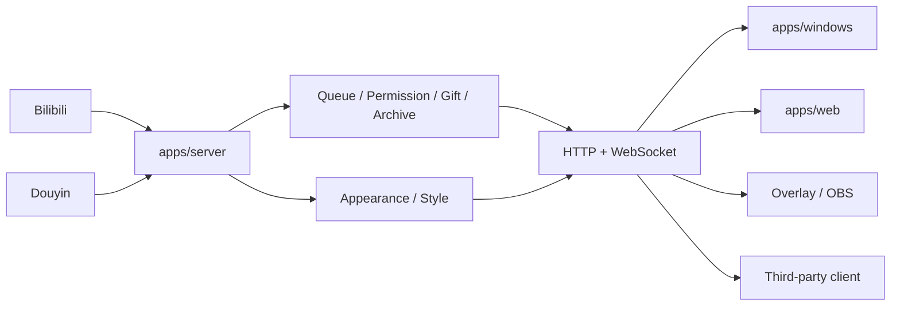

<div align="center">

# 🎬 BiliPDJ · 弹幕排队姬

面向 Bilibili / 抖音直播间的本地化弹幕排队、权限控制、队列存档与 OBS 展示工具

<p>
  <a href="https://github.com/ZzzHe2333/bilipdj/releases"></a>
  <a href="https://github.com/ZzzHe2333/bilipdj/blob/main/LICENSE"></a>
  <a href="https://github.com/ZzzHe2333/bilipdj/stargazers"></a>
  <a href="https://github.com/ZzzHe2333/bilipdj/issues"></a>
  <a href="https://github.com/ZzzHe2333/bilipdj/actions/workflows/quality.yml"></a>
</p>

<p>
  <a href="https://github.com/ZzzHe2333/bilipdj/releases">下载发行版</a> ·
  <a href="./core/GUIDE.md">使用教程</a> ·
  <a href="./core/UPDATE.md">更新日志</a> ·
  <a href="./packages/shared/api-contract.md">API 契约</a> ·
  <a href="https://github.com/ZzzHe2333/bilipdj/issues">问题反馈</a>
</p>

</div>

---

## ✨ 这是什么

主播开播时弹幕刷得飞快，想按顺序接观众的连麦 / 点歌 / 点评论需求却很难手动维护一份靠谱的队列。**BiliPDJ** 把「排队」这件事做成了一套完整、可离线运行的本地服务：监听直播间弹幕、按规则自动或手动排队、支持管理员权限与礼物特权、把队列实时推给 OBS 展示，数据全程留在自己的电脑上。

Server 是唯一业务状态源，Windows 客户端、Web 控制台、OBS 展示层和第三方客户端统一通过 HTTP / WebSocket 共享同一份队列、权限、礼物、平台连接、主题与存档状态——不管从哪个界面操作，看到的都是同一个真实状态。

> 当前正式接入的平台是 **Bilibili** 与 **抖音**，虎牙 / 快手 / 斗鱼 / 微信视频号目前仅保留配置位，尚未启用。

## 🚀 快速开始

不熟悉 Python、只想直接用的话，下载便携版即可，双击运行，不需要单独装 Python，也不需要手动起 Server。

| 版本 | 发行包 | 启动方式 | 说明 |
|---|---|---|---|
| 🖥️ Tk Windows 便携版 | [下载 `BiliPDJ-v3.0.2-Windows-Tk-Portable-x64.zip`](https://github.com/ZzzHe2333/bilipdj/releases/download/v3.0.2/BiliPDJ-v3.0.2-Windows-Tk-Portable-x64.zip) | 解压后双击 `main.exe` | 普通 Windows 用户请选择这个包 |
| 🌐 Web 便携版 | [下载 `BiliPDJ-v3.0.2-Web-Portable-x64.zip`](https://github.com/ZzzHe2333/bilipdj/releases/download/v3.0.2/BiliPDJ-v3.0.2-Web-Portable-x64.zip) | 解压后双击 `BiliPDJ-Web.exe` | 启动内置后端服务器，就绪后自动打开 Web 控制台 |

每个发行包都附带 `.sha256` 与 `update-manifest.json`。客户端更新时会先读取 manifest 拿到准确的包名、下载地址、大小和 SHA-256 再下载校验，不会靠猜版本号拼文件名。`Windows-Tk-files.json` 与 `Windows-Tk-Incremental-x64.pack` 是内置增量更新器使用的资源，普通用户无需手动下载。

## 🧩 功能一览

- 🎨 Windows / Web 共用同一套 **BiliPDJ Aurora** 主题，配置一次两端同步，还能互相导入 / 导出「主题 + OBS 样式」配置文件
- 🖌️ Web 样式页支持可视化设置 + 实时预览，同时保留高级 JSON 编辑
- 📦 Windows / Web 更新逻辑统一走 `update-manifest.json`，校验和下载全自动
- 🙋 Windows / Web 手动排队统一为「用户名必填、内容可选」，减少误操作
- 🔀 后端支持 Bilibili + 抖音同时接入，每个平台当前最多挂一个直播间
- 🧭 Windows / Web 导航统一为「更新软件 / 关于项目 / 支持我们」
- 🌗 Web 支持跟随系统 / 白天 / 夜晚 / 自定义配色
- 🗂️ 系统托盘隐藏与恢复，Web 便携启动器本质是一套本地后端服务器系统

## 🏗️ 项目结构

<details>
<summary>点击展开目录树</summary>

```text
bilipdj/
├─ apps/
│  ├─ server/                 # 后端真实实现，唯一业务状态源
│  │  ├─ server.py
│  │  ├─ appearance_guard.py  # Windows/Web 通用主题与 profile API
│  │  ├─ bilibili_*.py / douyin_*.py
│  │  └─ main.py
│  ├─ web/                    # Web 唯一源码目录
│  │  ├─ static/              # HTML/CSS/JS + Aurora Web 主题层
│  │  ├─ portable_launcher.py # Web 后端服务器系统启动器
│  │  ├─ web_portable.spec
│  │  └─ package-portable.ps1
│  └─ windows/                # Tk 桌面前端真实实现
│     ├─ control_panel.py
│     ├─ unified_theme.py     # Aurora Windows 主题映射与跨端导入/导出
│     ├─ overlay_host.py
│     ├─ update_*.py / updater*.py
│     ├─ main.py
│     └─ *.spec
├─ packages/shared/           # 前端/第三方客户端共享契约
├─ core/                      # 旧兼容层、兼容运行数据 + 项目文档中心
│  └─ appearance.json         # 源码模式默认通用主题配置
├─ scripts/                   # 必要构建、API 文档与安全检查脚本
└─ .github/workflows/
```

`core/` 已不再承载 Server 或 Windows 的主业务实现，迁移后的同名 Python 文件仅保留轻量转发，用来兼容旧代码里的 `import core.server`、`import core.control_panel` 之类的入口，真正的业务实现在 `apps/server` 与 `apps/windows`。项目的使用教程、更新日志、发行说明、贡献者说明和 AI 上下文也统一收在 `core/`，入口见 [core/README.md](./core/README.md)。

源码模式下的 `config.yaml`、`quanxian.yaml`、`kaiguan.yaml`、`style.json`、`appearance.json` 与 `core/cd/` 使用兼容运行位置，Web 静态资源只有 `apps/web/static/` 这一套。

</details>

## 🛠️ 开发

<details>
<summary>Windows 桌面端</summary>

源码启动：

```powershell
python -m pip install -r requirements.txt
python -m apps.windows.main
```

本地打包：

```powershell
powershell -ExecutionPolicy Bypass -File .\apps\windows\package.ps1 -InstallDependencies
```

主要产物：

```text
dist\bilipdj\main.exe
dist\bilipdj\paiduijitm.exe
dist\bilipdj\updater.exe
```

</details>

<details>
<summary>Web 前端</summary>

静态构建：

```bash
python apps/web/build.py
```

Windows Web 便携版：

```powershell
powershell -ExecutionPolicy Bypass -File .\apps\web\package-portable.ps1 -InstallDependencies
```

主要产物：

```text
dist\web-portable\bilipdj-web\BiliPDJ-Web.exe
```

</details>

<details>
<summary>Server 后端</summary>

```bash
python -m pip install -r apps/server/requirements.txt
python -m apps.server.main
```

局域网监听：

```bash
python -m apps.server.main --host 0.0.0.0 --port 9816
```

Docker：

```bash
docker build -f apps/server/Dockerfile -t bilipdj-server .
docker run --rm -p 9816:9816 bilipdj-server
```

后端一旦停止，Windows / Web / OBS / 第三方客户端都无法继续使用排队、弹幕和管理核心功能——它是名副其实的单一状态源。

</details>

## 🎨 Windows / Web 通用主题

Windows Tk 与 Web 控制台共用 Server 管理的 `appearance.json`，保存统一的 Aurora Design Tokens：白天/夜晚模式、品牌色、背景、侧栏、卡片、输入框、边框、文字、状态色、字体和字号等。

OBS / 队列展示仍然使用原来的 `style.json`，两者职责分开，避免破坏旧 OBS 样式。但用户导入 / 导出时会组合成同一种文件：

```json
{
  "schema": 1,
  "kind": "bilipdj-appearance-profile",
  "appearance": { "...": "Windows / Web 主题" },
  "display_style": { "...": "OBS / 队列样式" }
}
```

也就是说 **Windows 导出 → Web 可以直接导入，Web 导出 → Windows 也可以直接导入**。对应接口：

```text
GET  /api/appearance
POST /api/appearance
GET  /api/appearance/profile
POST /api/appearance/profile
```

旧版 Web localStorage 主题与旧 `style.json` 仍然提供迁移兼容，设置 ZIP / WebDAV 备份也会包含 `appearance.json`。

## 📡 默认地址

| 地址 | 用途 |
|---|---|
| `http://127.0.0.1:9816/control` | Web 管理控制台 |
| `http://127.0.0.1:9816/index` | 队列 / OBS 展示 |
| `GET /health` | 后端健康检查 |
| `GET /api/runtime-status` | 运行状态 |
| `GET /api/queue/state` | 队列状态 |
| `GET /api/platforms/active` | 多平台激活状态 |
| `GET /api/appearance` | Windows/Web 通用主题 |
| `ws://127.0.0.1:9816/ws` | WebSocket 实时事件 |

## 🧭 架构



核心原则只有一句话：**前端只负责交互、展示与调用 API，不复制 Server 的排队业务规则，也不维护另一套主题持久化状态。**

## ✅ CI / 构建验证

| Workflow | 作用 |
|---|---|
| `quality.yml` | Python 编译、后端兼容入口、API 文档覆盖与 Web 源码 smoke check |
| `server.yml` | 验证 Server 入口与 `core.server` 兼容层 |
| `web.yml` | 独立构建 Web 静态资源 |
| `package-windows-x64.yml` | 实际构建 Tk Windows Portable 与 Web Portable，并生成 ZIP / SHA256 / manifest |

仓库远端不再跟踪 `tests/`，`.gitignore` 会把它保留为本地开发测试空间——已有的本地测试文件可以继续用，但不会随普通提交带回 GitHub。正式合并前，以源码 smoke check、Server/Web 验证和实际 Windows Portable 构建作为远端验收链路。

## 🔌 API 与第三方客户端

想接第三方客户端，从 [packages/shared/api-contract.md](./packages/shared/api-contract.md) 开始看。完整开发参考可以本地生成：

```bash
python scripts/generate_api_docs.py
```

会生成到本地 `api/` 目录（该目录默认忽略，不提交仓库）。

## 🔒 安全提示

配置里可能包含 Cookie、`SESSDATA`、`bili_jct` 或其他登录凭据，**请勿提交到仓库或公开截图**。后端默认只监听 `127.0.0.1:9816`；局域网监听不等于公网鉴权，当前管理接口不应该直接暴露到公网。

## 📚 文档

| 文档 | 内容 |
|---|---|
| [core/README.md](./core/README.md) | 文档与兼容层总索引 |
| [core/GUIDE.md](./core/GUIDE.md) | 使用教程 |
| [core/UPDATE.md](./core/UPDATE.md) | 更新日志 |
| [core/RELEASE_NOTES.md](./core/RELEASE_NOTES.md) | 发行说明 |
| [core/CONTRIBUTORS.md](./core/CONTRIBUTORS.md) | 贡献者说明 |
| [core/ai.md](./core/ai.md) | AI / 自动化工具仓库上下文 |
| [packages/shared/api-contract.md](./packages/shared/api-contract.md) | 共享 API 契约、访问边界与第三方客户端说明 |

## 🤝 参与贡献

欢迎提 [Issue](https://github.com/ZzzHe2333/bilipdj/issues) 反馈 Bug 或提需求，详细规范见 [core/CONTRIBUTORS.md](./core/CONTRIBUTORS.md)。

## ⭐ Star History

[](https://star-history.com/#ZzzHe2333/bilipdj&Date)

## 📄 许可证

本项目基于 [GNU General Public License v3.0](./LICENSE) 发布。
