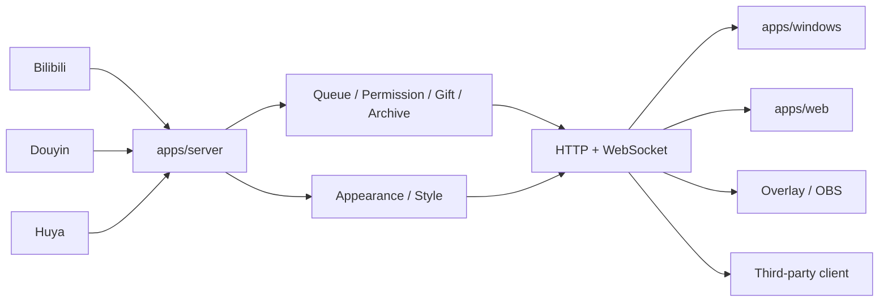

<div align="center">

# Bilipdj · 弹幕排队姬

**面向 Bilibili / 抖音 / 虎牙直播间的本地化弹幕排队、权限控制、队列存档与 OBS 展示工具。**

[下载发行版](https://github.com/ZzzHe2333/bilipdj/releases) · [使用教程](./core/GUIDE.md) · [更新日志](./core/UPDATE.md) · [API 契约](./packages/shared/api-contract.md) · [问题反馈](https://github.com/ZzzHe2333/bilipdj/issues)

</div>

---

BiliPDJ 采用单仓库 Monorepo。**Server 是唯一业务状态源**；Windows、Web、OBS 与第三方客户端统一通过 HTTP / WebSocket 使用同一套队列、权限、礼物、平台连接、主题、样式和存档状态。

> 当前正式接入的平台是 **Bilibili**、**抖音** 与 **虎牙**。快手、斗鱼、微信视频号目前仅保留配置位。

## v2.0.4 客户便携版

v2.0.4 提供两种 Windows x64 客户包，均自带后端和 Web 资源，不需要安装 Python，也不需要手工启动 Server。

| 版本 | 发布文件 | 启动方式 | 后端行为 |
|---|---|---|---|
| Tk Windows 便携版 | `BiliPDJ-v2.0.4-Windows-Tk-Portable-x64.zip` | 解压后双击 `main.exe` | 桌面前端自动拉起内置后端 |
| Web 便携版 | `BiliPDJ-v2.0.4-Web-Portable-x64.zip` | 解压后双击 `BiliPDJ-Web.exe` | 启动“后端服务器系统”，服务就绪后自动打开 Web 控制台 |

发行版同时提供 `.sha256` 与 `update-manifest.json`。客户端更新时先读取 manifest，由清单确定准确包名、下载地址、大小与 SHA-256，再下载校验，不再根据版本号猜文件名。

### 当前主要能力

- Windows / Web 更新逻辑统一使用 `update-manifest.json`；
- Web 样式页支持可视化设置与实时预览，保留高级 JSON；
- Windows / Web 使用同一套 **BiliPDJ Aurora** 主题配置；
- Windows 与 Web 可以相互导入/导出同一种主题 + OBS 样式配置文件；
- Web 便携启动器明确为“后端服务器系统”，支持系统托盘隐藏/恢复；
- Windows / Web 手动排队统一为“用户名必填 + 内容可选”；
- 后端支持 Bilibili + 抖音 + 虎牙同时激活，各平台当前最多一个直播间；
- Windows / Web 导航统一为“更新软件 / 关于项目 / 支持我们”；
- Web 支持跟随系统、白天、夜晚和自定义颜色。

## 当前目录

```text
bilipdj/
├─ apps/
│  ├─ server/                 # 后端真实实现、唯一业务状态源
│  │  ├─ server.py
│  │  ├─ appearance_guard.py  # Windows/Web 通用主题与 profile API
│  │  ├─ bilibili_*.py / douyin_*.py / huya_*.py
│  │  └─ main.py
│  ├─ web/                    # Web 唯一源码目录
│  │  ├─ static/              # HTML/CSS/JS + Aurora Web 主题层
│  │  ├─ portable_launcher.py # Web 后端服务器系统启动器
│  │  ├─ web_portable.spec
│  │  └─ package-portable.ps1
│  └─ windows/                # Tk 桌面前端真实实现
│     ├─ control_panel.py
│     ├─ unified_theme.py     # Aurora Windows 主题映射与跨端导入/导出
│     ├─ overlay_host.py
│     ├─ update_*.py / updater*.py
│     ├─ main.py
│     └─ *.spec
├─ packages/shared/           # 前端/第三方客户端共享契约
├─ core/                      # 旧兼容层、兼容运行数据 + 项目文档中心
│  └─ appearance.json         # 源码模式默认通用主题配置
├─ scripts/                   # 必要构建、API 文档与安全检查脚本
└─ .github/workflows/
```

### `core/` 的定位

`core/` 已不再承载 Server 或 Windows 的主业务实现。迁移后的同名 Python 文件仅保留轻量转发，以兼容旧代码中的 `import core.server`、`import core.control_panel` 等入口；业务实现位于 `apps/server` 与 `apps/windows`。

项目的使用教程、更新日志、发行说明、贡献者说明和 AI 上下文也统一放在 `core/`，入口见 [core/README.md](./core/README.md)。

源码模式下的 `config.yaml`、`quanxian.yaml`、`kaiguan.yaml`、`style.json`、`appearance.json` 与 `core/cd/` 使用兼容运行位置。Web 静态资源只有 `apps/web/static/` 一套。

## Windows 桌面端

源码启动：

```powershell
python -m pip install -r requirements.txt
python -m apps.windows.main
```

本地打包：

```powershell
powershell -ExecutionPolicy Bypass -File .\apps\windows\package.ps1 -InstallDependencies
```

主要产物：

```text
dist\bilipdj\main.exe
dist\bilipdj\paiduijitm.exe
dist\bilipdj\updater.exe
```

## Web 前端

静态构建：

```bash
python apps/web/build.py
```

Windows Web 便携版：

```powershell
powershell -ExecutionPolicy Bypass -File .\apps\web\package-portable.ps1 -InstallDependencies
```

主要产物：

```text
dist\web-portable\bilipdj-web\BiliPDJ-Web.exe
```

## Windows / Web 通用主题与配置

Windows Tk 与 Web 控制台共用 Server 管理的：

```text
appearance.json
```

它保存统一的 Aurora Design Tokens：白天/夜晚模式、品牌色、背景、侧栏、卡片、输入框、边框、文字、状态色、字体和字号等。

OBS / 队列展示仍使用原来的：

```text
style.json
```

两者职责分开，避免破坏旧 OBS 样式，但用户导入/导出时会组合成同一种文件：

```json
{
  "schema": 1,
  "kind": "bilipdj-appearance-profile",
  "appearance": { "...": "Windows / Web 主题" },
  "display_style": { "...": "OBS / 队列样式" }
}
```

因此：

```text
Windows 导出 → Web 可直接导入
Web 导出     → Windows 可直接导入
```

对应接口：

```text
GET  /api/appearance
POST /api/appearance
GET  /api/appearance/profile
POST /api/appearance/profile
```

旧 Web localStorage 主题与旧 `style.json` 仍提供迁移兼容。设置 ZIP / WebDAV 备份也会包含 `appearance.json`。

## Server 后端

```bash
python -m pip install -r apps/server/requirements.txt
python -m apps.server.main
```

局域网监听：

```bash
python -m apps.server.main --host 0.0.0.0 --port 9816
```

Docker：

```bash
docker build -f apps/server/Dockerfile -t bilipdj-server .
docker run --rm -p 9816:9816 bilipdj-server
```

后端停止后，Windows / Web / OBS / 第三方客户端都无法继续使用排队、弹幕和管理核心功能。

## 默认地址

| 地址 | 用途 |
|---|---|
| `http://127.0.0.1:9816/control` | Web 管理控制台 |
| `http://127.0.0.1:9816/index` | 队列 / OBS 展示 |
| `GET /health` | 后端健康检查 |
| `GET /api/runtime-status` | 运行状态 |
| `GET /api/queue/state` | 队列状态 |
| `GET /api/platforms/active` | 多平台激活状态 |
| `GET /api/appearance` | Windows/Web 通用主题 |
| `ws://127.0.0.1:9816/ws` | WebSocket 实时事件 |

## 架构



核心原则：**前端只负责交互、展示与调用 API，不复制 Server 的排队业务规则或持久化另一套主题状态。**

## CI / 构建验证

- `.github/workflows/quality.yml`：Python 编译、后端兼容入口、API 文档覆盖与 Web 源码 smoke check；
- `.github/workflows/server.yml`：验证 Server 入口与 `core.server` 兼容层；
- `.github/workflows/web.yml`：独立构建 Web 静态资源；
- `.github/workflows/package-windows-x64.yml`：实际构建 Tk Windows Portable 与 Web Portable，并生成 ZIP / SHA256 / manifest。

### 本地测试目录

仓库远端不再跟踪 `tests/`，`.gitignore` 会保留该目录作为本地开发测试空间。已有本地测试文件可以继续使用，但不会被普通提交重新带回 GitHub。正式合并前以源码 smoke check、Server/Web 验证和实际 Windows Portable 构建作为远端验收链路。

## API 与第三方客户端

第三方客户端应从 [packages/shared/api-contract.md](./packages/shared/api-contract.md) 开始。完整的开发参考可通过：

```bash
python scripts/generate_api_docs.py
```

生成到本地 `api/`（该目录默认忽略，不提交仓库）。

## 安全

配置可能包含 Cookie、`SESSDATA`、`bili_jct` 或其他登录凭据，请勿提交到仓库或公开截图。后端默认监听 `127.0.0.1:9816`；局域网监听不等于公网鉴权，当前管理接口不应直接暴露到公网。

## 文档

- [core/README.md](./core/README.md)：文档与兼容层总索引
- [core/GUIDE.md](./core/GUIDE.md)：使用教程
- [core/UPDATE.md](./core/UPDATE.md)：更新日志
- [core/RELEASE_NOTES.md](./core/RELEASE_NOTES.md)：发行说明
- [core/CONTRIBUTORS.md](./core/CONTRIBUTORS.md)：贡献者说明
- [core/ai.md](./core/ai.md)：AI / 自动化工具仓库上下文
- [packages/shared/api-contract.md](./packages/shared/api-contract.md)：共享 API 契约、访问边界与第三方客户端说明
- [Issues](https://github.com/ZzzHe2333/bilipdj/issues)：Bug、建议和任务跟踪

## 许可证

本项目基于 [GNU General Public License v3.0](./LICENSE) 发布。
